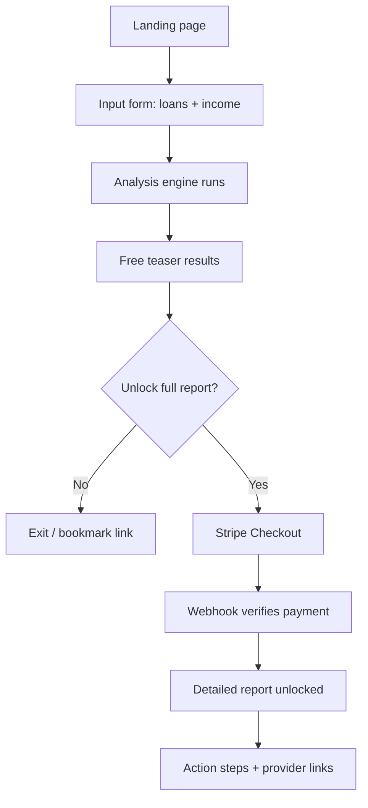

# Student Loan Repayment Analyzer — Functional Spec

2026-09-19 · prepared for Travis

## Overview & Goals

The app turns a 5-minute loan-and-income intake into a paid, actionable student-loan repayment plan: free users get a directional signal that better options exist, and paying users get specific numbers, a ranked action list, and links to start each option.

Goals:

1. Convert visitors into a single one-time Stripe payment per analysis ($9–$19 assumed — see Open Questions) with no subscription and no account required for v1.
2. Differentiate on privacy: no persistent storage of loan balances, income, or other financial detail beyond a short, expiring session used to bridge free results to the paid report.
3. Cover four strategy families: refinancing, income-driven repayment, consolidation, and forgiveness (PSLF and related programs).
4. Stay a decision-support tool, not a licensed financial or legal advisor and not a loan originator (see Compliance, Disclaimers & Legal Risks).

Out of scope for v1: user accounts, saved report history, in-app loan applications, and subscription billing (full list in Out of Scope & Open Questions).

## User Journey & Flow



If a paying user closes the tab before viewing the report, an optional emailed magic link (opt-in only, to protect the privacy-first positioning) or a Stripe receipt lookup recovers the report for a defined window (7 days assumed). After that window the ephemeral record expires and a fresh analysis is required.

## Input Form: Fields & Validation

| Field | Level | Required | Notes |
| --- | --- | --- | --- |
| Loan type | Per loan | Yes | Direct Subsidized/Unsubsidized, Direct PLUS, FFEL, Perkins, or Private — determines which strategies apply |
| Balance | Per loan | Yes | Must be > $0 |
| Interest rate | Per loan | Yes | 0–25% |
| Servicer | Per loan | No | Improves provider-link targeting |
| Annual gross income | Borrower | Yes | ≥ $0; $0 is a valid input (unemployed) |
| Household size | Borrower | Yes | Drives the IDR/RAP poverty-line calculation |
| Filing status | Borrower | Yes | Single / married filing jointly / married filing separately — affects how spousal income counts under RAP and IBR |
| State of residence | Borrower | No | Some forgiveness programs are state-specific |
| Employment sector | Borrower | Yes | Nonprofit/government (PSLF flag), private, or self-employed |
| Years already in qualifying repayment | Borrower | No | Improves the PSLF/forgiveness progress estimate |
| Credit score band | Borrower | No | <650 / 650–699 / 700–749 / 750+ — used only for the refinance rate tier |

At least one loan is required. All numeric fields are client-side range-checked before submit, with inline errors. Optional fields are labeled "improves accuracy" rather than required, to keep the form short.

## Analysis Engine: Logic & Formulas

As of September 2026 the federal repayment landscape is mid-transition under the One Big Beautiful Bill Act, so every rate, bracket, and eligibility rule must live in refreshable configuration, never a hardcoded constant. Current landscape ([source](https://www.tateesq.com/learn/student-loan-repayment-options)):

| Plan | Status (Sep 2026) | Key mechanic |
| --- | --- | --- |
| SAVE | Vacated by court order Mar 10, 2026; \~7.5M affected borrowers must pick a new plan by Sep 30, 2026 | No longer selectable |
| IBR | Only IDR plan with permanent status | Partial-financial-hardship requirement removed; open to loans disbursed before Jul 1, 2026 |
| RAP (new) | Effective Jul 1, 2026 | Payment set by an 11-bracket table on AGI (1%-10% of AGI), $10/month minimum; unpaid interest is waived, not capitalized |
| PAYE / ICR | Closed to new enrollees Jul 1, 2026; existing enrollees sunset by Jul 1, 2028 | Borrowers must eventually transition off |
| Tiered Standard (new) | Fixed 10/15/20/25-year term set by balance | No income-based forgiveness, no payment cap |

**A. Refinance** - applies to any loan type given a usable credit band. Compare the user's balance-weighted current rate to a configurable illustrative-rate-by-credit-tier table (populated from rate-comparison sites, refreshed periodically - see Technical Architecture for why no live lender-rate API exists for this). Flag refinance when the rate gap times remaining balance implies meaningful savings (configurable threshold). Mandatory warning whenever the user holds any federal loan: refinancing converts it to private and permanently forfeits IDR/RAP/PSLF/deferment/forgiveness eligibility.

**B. Income-driven repayment (IBR/RAP)** - applies to federal Direct loans only (FFEL/Perkins must consolidate first). Compute both IBR and RAP where eligible for both, and surface the lower payment plus the trade-off (RAP waives unpaid interest but has no low-end cap beyond $10/month; IBR retains the legacy 20/25-year forgiveness framing). Discretionary-income formula (used by IBR and legacy plans):

```latex
\text{Discretionary Income} = \text{AGI} - (\text{Poverty Line Multiplier} \times \text{Federal Poverty Guideline}_{\text{household size}})
```

```latex
\text{Monthly Payment} = \max\left(\frac{\text{Payment \%} \times \text{Discretionary Income}}{12},\ \text{Plan Minimum}\right)
```

RAP does not use discretionary income - it applies its own percentage directly against AGI by bracket - so store it as a separate bracket-lookup structure rather than forcing it through the formula above. If the estimated payment is below the user's stated current payment, surface it as a relief option.

**C. Consolidation** - applies to users holding FFEL, Perkins, or Parent PLUS loans. Time-sensitive rule: the deadline to consolidate those loan types and preserve IDR/PSLF eligibility was June 30, 2026 - already past as of this spec ([source](https://thecollegeinvestor.com/74391/how-to-consolidate-student-loans-before-june-2026-deadline/)). The engine must check today's date against this deadline at runtime: pre-deadline, recommend consolidation as an IDR/PSLF prerequisite; post-deadline, show that unconsolidated FFEL/Perkins/Parent PLUS loans have permanently lost IDR/PSLF eligibility, and that consolidation now only offers rate-averaging and single-payment simplification. New rate = the weighted average of consolidated loans, rounded up to the nearest 1/8%.

**D. Forgiveness (PSLF and related)** - PSLF applies to federal Direct loans, a qualifying employer (nonprofit/government), a qualifying repayment plan, and 120 qualifying payments. A rule effective Jul 1, 2026 newly excludes employers found to have a "substantial illegal purpose," applied prospectively only with no retroactive credit loss ([source](https://www.ed.gov/media/document/fact-sheet-restoring-public-service-loan-forgiveness-its-statutory-purpose-october-30-2025-112456.pdf)); this is politically contested and the config must track further changes. If the user supplies years already in qualifying employment, estimate progress toward 120 payments; otherwise show eligibility only, no progress bar. Also flag legacy 20/25-year IDR forgiveness and any state-specific program matched by the optional state field.

**Ranking** - score each applicable strategy by estimated dollar impact (refinance, IDR) or eligibility strength (consolidation, forgiveness) and present in that order. A strategy the user is ineligible for is omitted entirely, never shown as "not recommended."

## Free-Tier Output (Teaser Results)

- A count of eligible strategies found (e.g., "We found 3 ways to potentially lower your payments").
- One plain-language headline per strategy, no dollar figures and no provider names (e.g., "Refinancing could lower your rate," "You may qualify for income-driven repayment," "Consolidating could unlock other benefits").
- One fuzzy, rounded combined savings range (e.g., "$1,200-$4,800/year potential"), clearly labeled as a rough estimate.
- Locked or blurred cards for exact numbers, action steps, and provider links, next to the unlock CTA.
- No email or account required to reach this screen.

## Payment Gate (Stripe Integration)

1. User clicks "Unlock full report" - backend creates a Stripe Checkout Session (one-time payment mode) with `client_reference_id` set to a random session token (never PII) mapped to the encrypted analysis result.
2. User completes payment on Stripe-hosted checkout.
3. Stripe redirects to `success_url` with a `session_id`, and separately sends a `checkout.session.completed` webhook.
4. Backend verifies payment status via the Stripe API - never trusting the client-side redirect alone - before unlocking anything.
5. On verified payment, backend issues a short-lived signed access token scoped to that session, used to fetch the detailed report from the ephemeral store.
6. Failure or cancel returns the user to the free results screen with a retry CTA; an idempotency key on session creation prevents double-charging on refresh or resubmission.
7. Refund policy is a business decision to finalize before launch (see Out of Scope & Open Questions).

## Paid-Tier Detailed Report & Provider Links

Per recommended strategy, the report shows: the estimated new payment, monthly/annual/lifetime savings, the trade-offs (from the Analysis Engine), and a short action checklist. It stays accessible via a magic link for a defined window (7 days assumed) and can optionally be downloaded or printed.

| Strategy | Where to start | Notes |
| --- | --- | --- |
| Refinance | 2-4 curated private lenders or a comparison site | Any affiliate/referral link needs an FTC-compliant disclosure |
| Federal IDR (IBR/RAP) | studentaid.gov application portal | Official government site, never an affiliate link |
| Consolidation | studentaid.gov consolidation application | Official government site |
| PSLF | studentaid.gov/pslf + PSLF Help Tool | Official government site |

The provider directory (strategy type, name, URL, description, affiliate flag, state and credit-tier restrictions) should be config-driven rather than hardcoded, since this landscape - and the lender list itself - changes often (see Analysis Engine).

## Data Handling & Privacy Architecture

This is the app's core differentiator, so it must be explicit rather than implied:

- No plaintext persistence of loan balances, income, or other borrower detail beyond a TTL-bound record (24-72 hours assumed) that exists only to bridge the free result to the paid report.
- No SSN or account credentials collected - neither is needed for this calculation.
- Payment data never touches the app's servers; Stripe handles PCI compliance entirely.
- Automatic expiry (TTL) on the ephemeral record, plus a user-facing "delete my data now" action as good practice.
- A privacy policy discloses exactly what's collected, why, the retention window, and Stripe as the payment processor.

Recommended implementation: an ephemeral serverless model (data processed in-memory over TLS, discarded after response, bridged by a TTL-keyed encrypted blob) rather than fully client-side, because the configuration tables in the Analysis Engine section are best kept server-side and centrally updatable.

## Technical Architecture & Stack

- Frontend: a static single-page app (React or similar), hosted on Vercel, Netlify, or CloudFront.
- Backend: serverless functions for (a) Stripe Checkout session creation, (b) Stripe webhook handling, (c) ephemeral store read/write, and (d) analysis compute if not fully client-side.
- Ephemeral store: Redis (e.g., Upstash) or DynamoDB with a TTL attribute - never a durable database for loan or income data.
- No user accounts or auth needed for v1; access is session-token and payment based.

**Correction to the original brief:** "FICO, Sallie Mae, and FedLoan" APIs aren't usable as described. FedLoan Servicing was discontinued and its accounts transferred to MOHELA back in 2022, and there is no public, free API from FICO or a single servicer that fits this use case. Rate and eligibility data should instead come from a manually curated, periodically refreshed configuration table - federal rules sourced from studentaid.gov, refinance rate ranges from comparison sites - not a live third-party API.

## Compliance, Disclaimers & Legal Risks

- A persistent disclaimer that this is educational estimation, not financial, legal, or tax advice, and that users should consult a qualified advisor or their loan servicer/studentaid.gov.
- No language implying personalized fiduciary advice.
- An FTC-compliant affiliate disclosure wherever a provider link is an affiliate or referral link.
- An accuracy disclaimer noting all figures are estimates and actual servicer/lender terms may differ.
- Terms of Service and a Privacy Policy required before payment.
- Open legal risk, not resolved by this spec: some states regulate financial-advice-adjacent tools. A legal review of the specific output language is recommended before public launch.
- Regulatory volatility: the RAP/PSLF changes in the Analysis Engine section are recent, contested (e.g., proposed legislation to reverse the PSLF changes), and still being litigated in places. Commit to a recurring - at least monthly - rules-review process rather than a build-once mentality.

## Non-Functional Requirements & Edge Cases

| Area | Requirement |
| --- | --- |
| Performance | Form-to-results in under 3s client-side, or under 5s with a serverless round trip |
| Availability | 99.5%+ (a realistic target for a serverless architecture) |
| Security | TLS everywhere; Stripe webhook signature verification; rate limiting and bot protection on the analysis endpoint |
| Accessibility | WCAG 2.1 AA on the form and results pages |
| Responsiveness | Mobile-first, responsive layout |

Edge cases:

- All-private-loan user: skip IDR/PSLF/federal-consolidation sections entirely and show refinance only.
- $0 income: an IDR/RAP payment may compute to $0 - treat that as a valid, positive result, not an error.
- FFEL/Perkins/Parent PLUS holder past the June 30, 2026 consolidation deadline: show the permanent-eligibility-loss message from the Analysis Engine, not a generic "consolidate now" nudge.
- Paid user's session expires before viewing the report: recover via an opted-in magic link or Stripe receipt lookup within the report's access window.
- Duplicate or rapid resubmission: an idempotency key on checkout session creation prevents double-charging.
- Out-of-range inputs (e.g., a 200% interest rate): caught by client-side validation before submit.

## Success Metrics

| Metric | What it tells you |
| --- | --- |
| Free-to-paid conversion rate | Whether the teaser is compelling enough to pay for |
| Funnel drop-off by step | Where users abandon: form start, form complete, results view, checkout start, checkout complete |
| Average revenue per completed analysis | Whether the price point is calibrated |
| Refund/chargeback rate | A trust and output-quality signal |
| Provider-link click-through (post-purchase) | Whether the report actually drives next steps |

## Out of Scope & Open Questions

Out of scope for v1: user accounts/login, saved report history, live rate APIs, in-app loan applications or origination, a native mobile app, multi-language support, and subscription billing.

Open questions to settle before build:

- Exact price point - $9-$19 one-time is assumed above but not confirmed.
- Refund policy - none, or conditional.
- Whether to collect an optional email at checkout for report recovery, given the privacy-first positioning - a deliberate trade-off, not a default.
- Legal review of advice-adjacent language, state by state.
- An owner for keeping the RAP/IBR/PSLF/consolidation-deadline configuration current. This is a live regulatory area - SAVE-plan borrowers are mid-transition through Sep 30, 2026 as this spec is written - and stale numbers here directly produce bad recommendations.

Sources consulted for the regulatory facts above: [Federal Student Loan Repayment Plans in 2026 (Tate Law)](https://www.tateesq.com/learn/student-loan-repayment-options), [PSLF final rule fact sheet (ED.gov)](https://www.ed.gov/media/document/fact-sheet-restoring-public-service-loan-forgiveness-its-statutory-purpose-october-30-2025-112456.pdf), [Consolidation deadline explainer (The College Investor)](https://thecollegeinvestor.com/74391/how-to-consolidate-student-loans-before-june-2026-deadline/).
